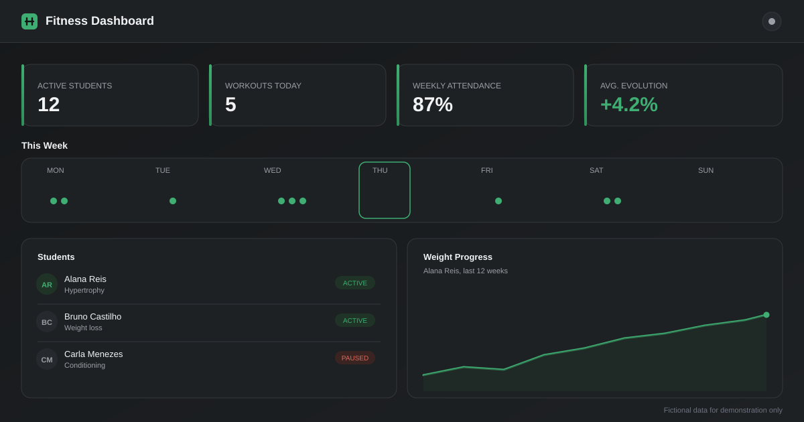

<div align="center">

# Fitness Dashboard

A client-side dashboard for personal trainers to manage students, workouts, and progress tracking.



</div>

## Overview

Fitness Dashboard is a demo web app for personal trainers to track students, schedule workouts, and follow physical progress over time. It runs entirely in the browser, with no backend, no accounts, and no real data: all information is fictional and generated on first load.

## Highlights

- Overview metrics: active students, workouts scheduled today, weekly attendance rate, and average evolution
- Weekly calendar showing scheduled workouts per day
- Student list with generated-initials avatars, goal, status, and last activity, with search and filter by goal
- Create, edit, and remove students, with a detail view showing height, current weight, evolution percentage, and a weight history chart rendered in plain SVG
- Create and edit workouts with exercises (sets, reps, load, notes), and mark them as completed from the workout history
- Light and dark theme, persisted in `localStorage` and applied before first paint
- Accessible modals with focus trap, `Escape` to close, and focus restored on close
- Fully responsive layout, from mobile to desktop

## Tech Stack

- [Next.js](https://nextjs.org) (App Router)
- [React](https://react.dev)
- [TypeScript](https://www.typescriptlang.org)
- [Tailwind CSS v4](https://tailwindcss.com)
- [lucide-react](https://lucide.dev) for icons

All data (students, workouts, theme preference) is generated at runtime and persisted in the browser's `localStorage`. There is no database, no authentication, and no external API calls.

## Getting Started

```bash
npm install
npm run dev
```

Open [http://localhost:3000](http://localhost:3000) to view the app.

Other available scripts:

```bash
npm run build   # create a production build
npm run start   # run the production build
npm run lint    # run ESLint
```

## Project Structure

```
src/
  app/            App Router entry point, global styles, root layout
  components/     UI components (cards, modals, charts, dashboard widgets)
  hooks/          Client hooks for students, workouts, theme, toasts, modal a11y
  lib/            Types, localStorage persistence, seed data, metrics, date utils
public/
  preview.svg     Dashboard preview image used in this README
```

## License

Licensed under the [MIT License](LICENSE).

---

<div align="center">

Built as a public portfolio project.

</div>
